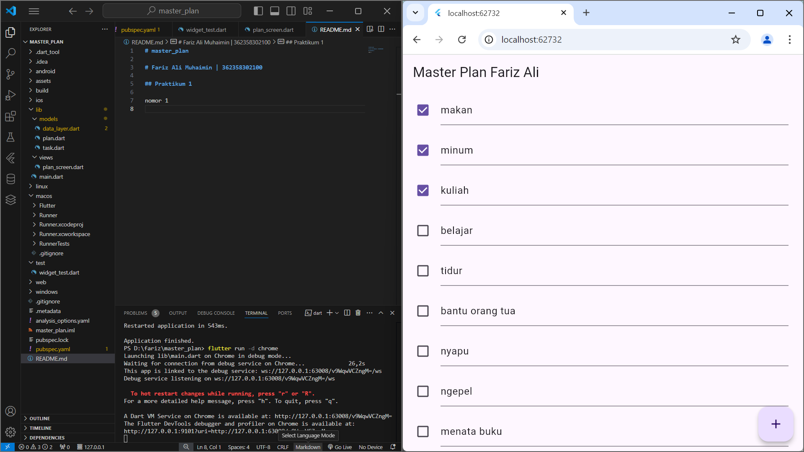
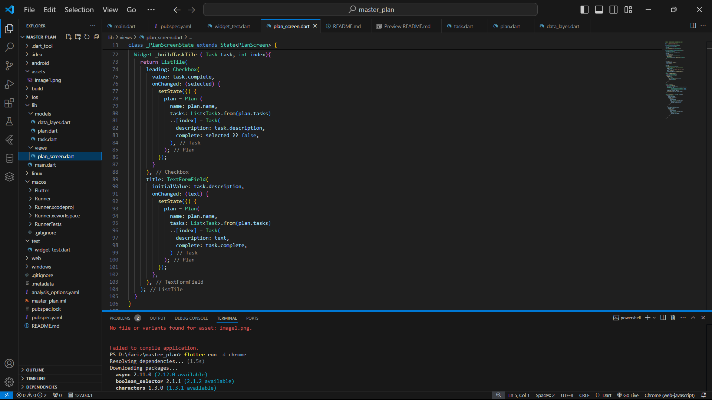

# master_plan

# Fariz Ali Muhaimin | 362358302100

## Praktikum 1 
### Tugas Praktikum 1
nomor 1 

nomor 2
karena dalam langkah tersebut bertujuan untuk memperingkas proses import yang dilakukan dan mempermudah pengelolaan akses seiring dengan perkembangan aplikasi, selain itu proses tersebut juga dapat menjaga struktur kode agar tetap kelihatan lebih rapi dan singkat, serta mendukung Modularisasi agar file dapat diakses dengan mudah dari tempat lain tanpa mengganggu struktur folder atau file asli.

nomor 3
karena varibel plan digunakan untuk menyimpan data yang akan diolah dan ditampilkan di aplikasi. selain itu, meyimpan data model dalam variabel terpisah mempermudah pemisahan logika dan logika tampilan.
dibuat sebagai const (konstanta) agar data tidak terjadi perubahan, sehingga dapat menghemat memori dan meningkatkan performa. 

nomor 4 

Langkah 9 membuat tampilan daftar tugas menggunakan ListTile dengan dua elemen interaktif:

-- Checkbox:

Checkbox ini mencerminkan status apakah suatu tugas sudah selesai atau belum.

Saat pengguna menekan checkbox, nilai complete pada objek Task diperbarui melalui setState(), yang menyebabkan tampilan diperbarui untuk mencerminkan status baru.

--TextFormField:

Kolom ini menampilkan deskripsi tugas dan memungkinkan pengguna mengubahnya.

Ketika teks diubah, deskripsi tugas juga diperbarui menggunakan setState(), dan tampilan kembali diperbarui untuk menampilkan nilai terbaru.

--Penjelasan Alur Kerja :

Setiap kali pengguna mengubah status checkbox atau mengedit teks di TextFormField, variabel plan diubah menggunakan setState() dengan cara membuat instance baru dari Plan dan Task.

Proses ini menjamin bahwa data tugas tetap sinkron dengan tampilan UI.

nomor 5

--pada langkah 11 

Kegunaan initState: Metode ini dipanggil sekali ketika State pertama kali diinisialisasi. Ini adalah tempat yang ideal untuk melakukan pengaturan awal, seperti menginisialisasi variabel atau listener yang dibutuhkan selama State tersebut hidup.

Kegunaan ScrollController: ScrollController digunakan untuk mengontrol perilaku scroll di widget scrollable, seperti ListView. Dengan menambahkan addListener ke scrollController, kita bisa mendeteksi perubahan dalam posisi scroll.

Memfokuskan Fokus pada Node Baru: Di dalam listener, perintah FocusScope.of(context).requestFocus(FocusNode()) membuat aplikasi mengalihkan fokus ke FocusNode baru ketika pengguna menggulir daftar. Ini sering digunakan untuk menghilangkan keyboard ketika pengguna mulai menggulir, menjaga tampilan tetap rapi dan fokus pada daftar.

-- pada langkah 13 

Kegunaan dispose: Metode ini dipanggil ketika State dihapus atau tidak lagi dibutuhkan, biasanya ketika pengguna meninggalkan halaman atau widget yang memiliki State tersebut dihapus dari widget tree.

Membersihkan ScrollController: Dengan memanggil scrollController.dispose(), kita memastikan bahwa semua listener dan resource yang terkait dengan scrollController dibersihkan dengan benar, menghindari kebocoran memori dan masalah performa aplikasi.

kesimpulan 

initState: Menyiapkan ScrollController dan listener untuk menangani fokus saat pengguna menggulir.

dispose: Membersihkan ScrollController ketika State sudah tidak diperlukan.